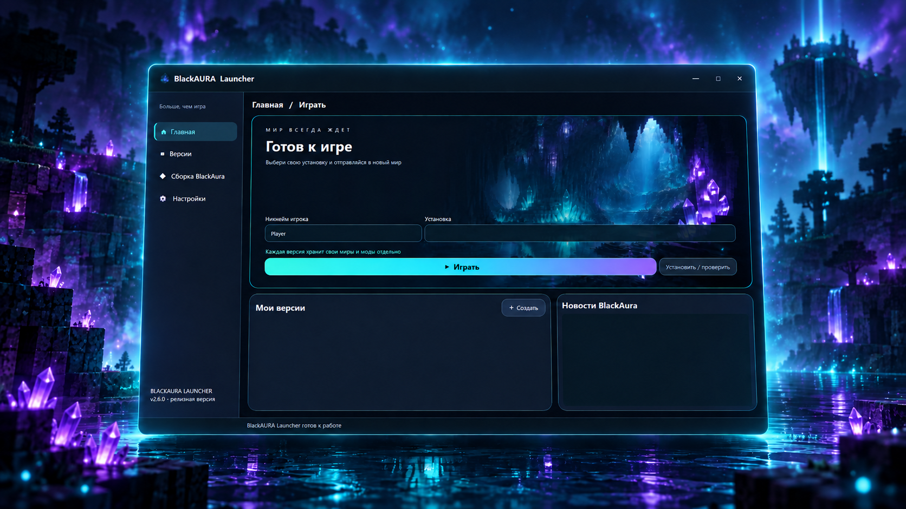

# BlackAURA Launcher

**Больше, чем игра. Твой Minecraft — твои правила.**

BlackAURA Launcher — современный лаунчер Minecraft для Windows с отдельными мирами и настройками для каждой версии, автоматической подготовкой игры и встроенной сборкой BlackAura.

## Возможности

- единый каталог версий Minecraft и популярных загрузчиков;
- Forge, ForgeOptiFine, Fabric, NeoForge и Quilt;
- отдельные папки, миры, моды и настройки для каждой установки;
- встроенная сборка BlackAura для Minecraft 1.19.4;
- готовые профили Low, Balanced и Ultra;
- автоматическая установка подходящей Java;
- удобная настройка оперативной памяти, разрешения и полноэкранного режима;
- библиотека иконок из блоков и предметов Minecraft;
- восстановление прерванных загрузок и переустановка повреждённых версий;
- автоматическое обновление лаунчера без ручной замены файлов.

## Установка

1. Откройте раздел **Releases**.
2. Скачайте `BALauncher.exe` из последнего выпуска.
3. Запустите файл — всё необходимое лаунчер подготовит автоматически.

## Системные требования

- Windows 10 или Windows 11, 64-bit;
- подключение к интернету для установки игры и обновлений;
- рекомендуемый объём оперативной памяти — от 8 ГБ.

Использование BlackAURA Launcher означает согласие с условиями [лицензионного соглашения](LICENSE).
