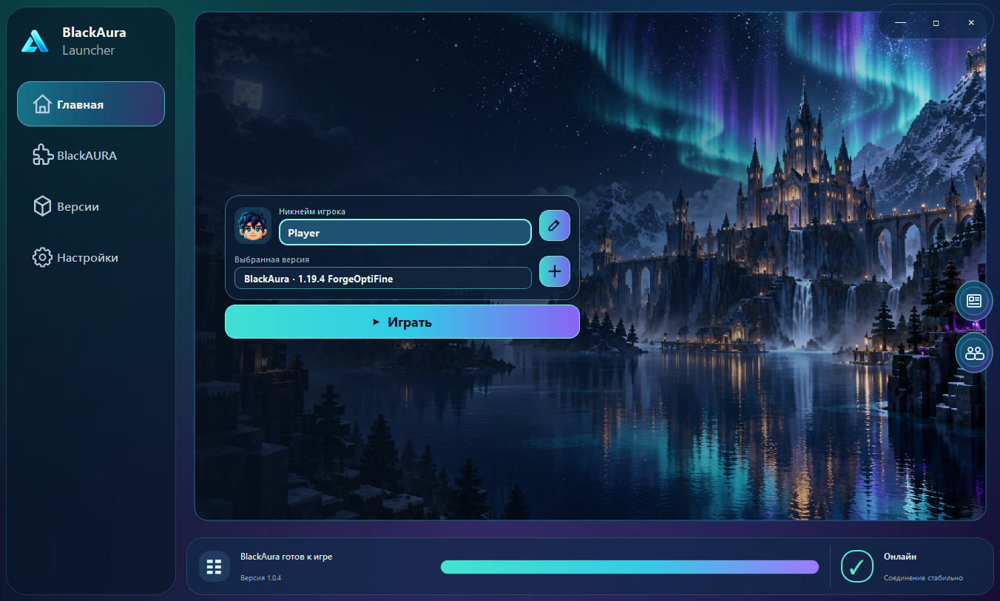

# BlackAURA Launcher

**Твой Minecraft — твои правила.**

BlackAURA — неофициальный лаунчер Minecraft: Java Edition для Windows. Устанавливайте игру, выбирайте отдельные версии и запускайте сборку BlackAURA с профилями Low, Balanced и Ultra.

## Что нового в 1.2.2

Кнопка Херобрина позволяет включать и выключать мод одним выбором для всех пресетов. Выбор сохраняется после обновления и восстановления. Перед отключением в существующем мире сохраните его копию: мод добавляет собственные блоки и сущности. Обучение стало подробнее, но каждый шаг остаётся коротким. Обновлятор показывает переход между версиями. Обновлены моды сборки, включая музыкальный плеер. Дополнительного постоянного опроса сервера нет.

## Играть вместе

1. Оба игрока обновляют лаунчер и запускают одинаковую установку игры через него — BlackAura или обычную версию Minecraft с одинаковыми модами и загрузчиком.
2. Хозяин открывает одиночный мир для сети, вводит показанный Minecraft порт и создаёт комнату.
3. Друг вводит ключ комнаты; хозяин принимает запрос.
4. После готовности соединения друг копирует адрес **из своего лаунчера** и вставляет его в Minecraft: «Сетевая игра» → «Прямое подключение».

Комната рассчитана на восемь человек, включая хозяина, и работает до четырёх часов с момента создания. На устройстве может быть одна активная комната; следующая доступна через 30 минут после завершения предыдущей. При кратком обрыве связи есть до трёх минут для восстановления той же комнаты. Лаунчер хозяина и гостей должен оставаться открытым. При закрытии мира комната завершается.

Совместная игра проверена для сборки BlackAURA на Minecraft 1.19.4. Другие версии и модификации могут иметь ограничения совместимости. Соединение между разными сетями зависит от их настроек: не каждый роутер или провайдер допускает его. Если адрес для игры не появился, воспользуйтесь диагностикой в комнате. Дополнительную программу устанавливать не нужно.

## Обычная игра

Установки имеют отдельные миры, моды и настройки. Полностью установленную игру можно запускать без интернета, кроме случаев уже полученного требования обновления или временного запрета запуска. Новости и обычные уведомления отображаются внутри лаунчера. Визуальные эффекты можно отключить в настройках.

Сборка BlackAURA включает оригинальные моды Loot Cases, Timelapse Sleep и Day & Night. Сторонние модификации принадлежат своим авторам.

## Скачать и связаться

[Скачать актуальный BALauncher.exe](https://github.com/lyprot/BlackAura-Launcher/releases/latest) · [Новости ВКонтакте](https://vk.ru/blackauralauncher) · [Сообщить об ошибке](https://vk.me/blackauralauncher)

Лаунчер и материалы BlackAURA предоставляются по [лицензионному соглашению](LICENSE). Публичная доступность не разрешает перепубликацию, изменение или продажу. BlackAURA не является официальным продуктом Mojang Studios или Microsoft.
